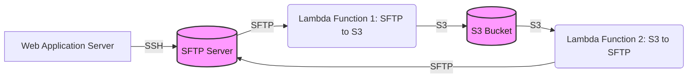
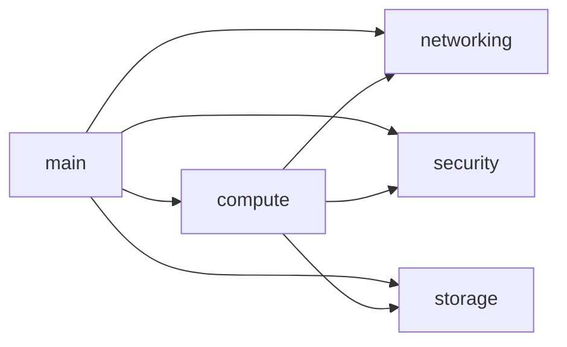
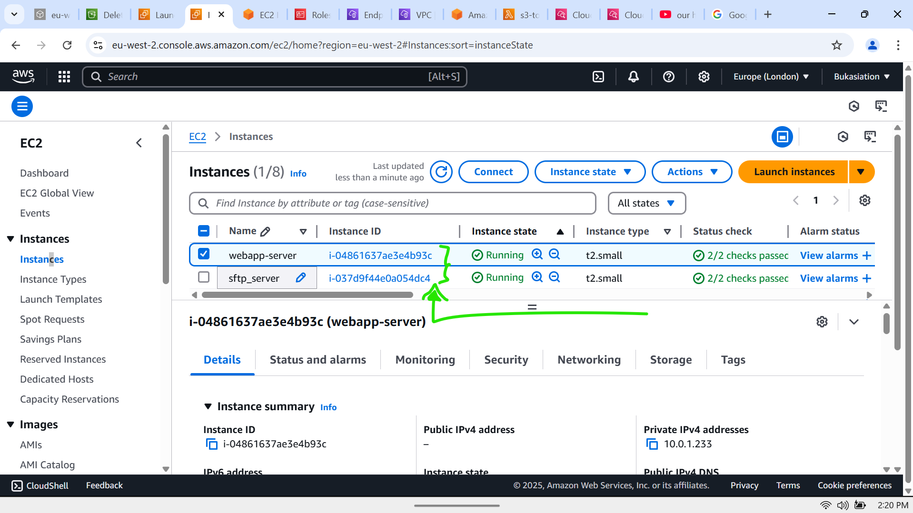
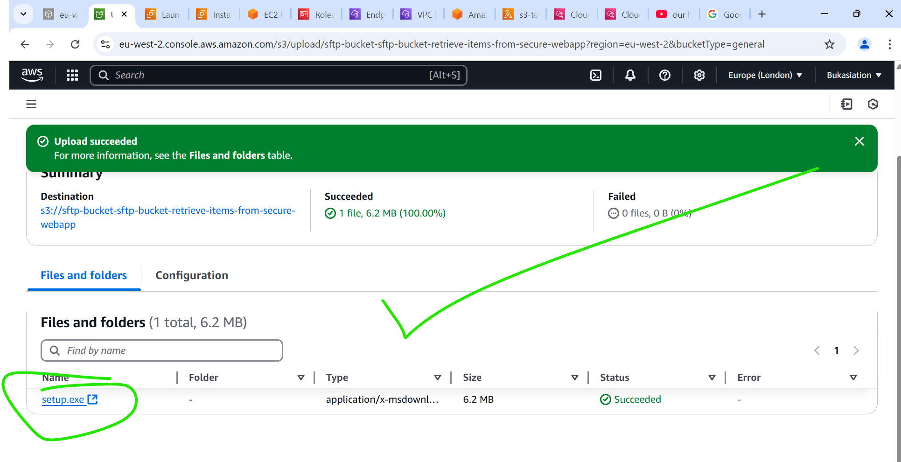
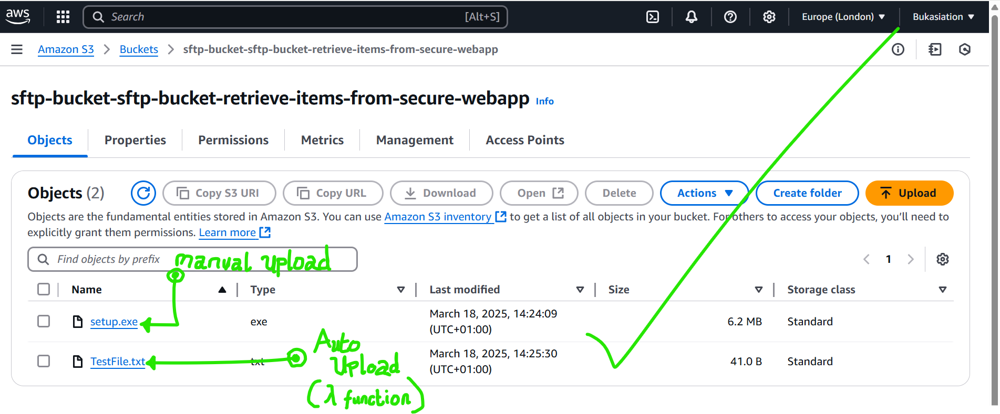
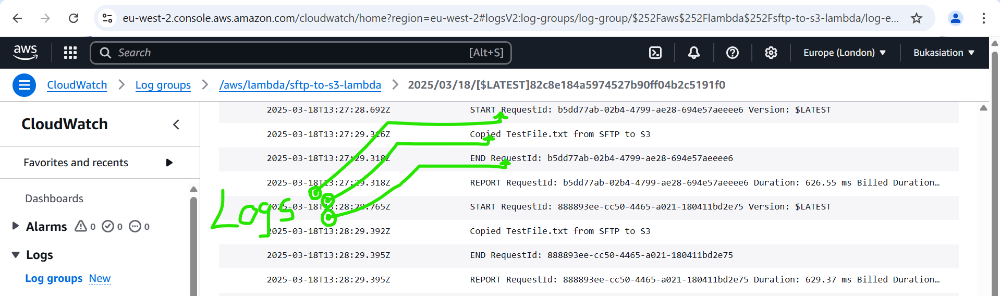

# Secure Web Application Project Documentation

## Overview

This project implements a secure web application environment on AWS, here we utilized various services to ensure security, privacy, and efficient data transfer. The architecture includes a web application server, a secure file transfer protocol (SFTP) server, and an S3 bucket for storage, all these are interconnected via Lambda functions in the VPC.

## Architecture Diagram



### Components

*   **Web Application Server:** An EC2 instance hosting the web application.
*   **SFTP Server:** An EC2 instance configured as an SFTP server for secure file transfer.
*   **S3 Bucket:** An S3 bucket used for storing files transferred from the SFTP server.
*   **Lambda Functions:**
    *   **SFTP to S3 Lambda:** Triggers on a schedule, connects to the SFTP server, and transfers files to the S3 bucket.
    *   **S3 to SFTP Lambda:** Triggers when new objects are created in the S3 bucket, and transfers files to the SFTP server.
*   **Networking (VPC, Subnets, Security Groups):** Provides a secure and isolated network environment for the application.
*   **IAM Roles and Policies:** Defines permissions for Lambda functions to access AWS resources.
*   **CloudWatch Event Rules:** Schedules the SFTP to S3 Lambda function.

## Modules

The project is structured into Terraform modules for better organization and reusability.

*   **compute:** Defines the EC2 instances for the web application and SFTP servers, as well as the Lambda functions.
*   **networking:** Configures the VPC, subnets, route tables, and internet gateway.
*   **security:** Creates security groups to control network traffic.
*   **storage:** Defines the S3 bucket for storing files.

### Module Dependency Graph



## Infrastructure Setup

### Prerequisites

*   AWS Account
*   Terraform installed
*   AWS CLI configured with appropriate credentials

### Deployment Steps

1.  **Clone the repository:**

    ```bash
    git clone https://github.com/Kosenuel/secure-webapp-infra.git
    cd secure-webapp-infra
    ```

2.  **Initialize Terraform:**

    ```bash
    terraform init
    ```

3.  **Review and customize terraform.tfvars:**

    ```tfvars
    region               = "eu-west-2"
    account_id           = "412*****5336"
    az1                  = "eu-west-2a"
    az2                  = "eu-west-2b"
    ami                  = "ami-00710ab5544b60cf7" # Amazon Linux for "eu-west-2" Region
    webapp_instance_type = "t2.small"
    sftp_instance_type   = "t2.small"


    tags = {
      Environment       = "Production"
      Owner             = "Emmanuel Okose"
      Terraform-Managed = "True"
      Project           = "Secure Ops (Web-App)"
    }
    ```

4.  **Apply the Terraform configuration:**

    ```bash
    terraform apply
    ```

5.  **Confirm the changes and enter `yes` to proceed.**

### Post-Deployment Steps

1.  **Access the Cloud Watch Logs:** This is where you can come to confirm that the lambda functions are working as expected.
2.  **S3 Bucket Access:** Navigate to the newly created s3 bucket and you should expect to see a `TestFile.txt` uploaded there, this file was copied from the SFTP server and you can confirm this from the CloudWatch Logs.

## Configuration Details

### Networking Module

*   **VPC:** `10.0.0.0/16`
*   **Private Subnets:**
    *   `10.0.1.0/24` (Availability Zone 1)
    *   `10.0.2.0/24` (Availability Zone 2)
*   **Public Subnet:** `10.0.3.0/24` (Availability Zone 1)
*   **Internet Gateway:** Provides internet access to the public subnet.
*   **Route Tables:** Configured for private and public subnets.
*   **S3 VPC Endpoint:** Enables private access to S3 from within the VPC.

### Security Module

*   **Webapp Security Group:** Allows outbound traffic to the SFTP server on port 22.
*   **SFTP Security Group:** Allows inbound traffic from the web application server and Lambda function on port 22.
*   **Lambda Security Group:** Allows outbound traffic to the SFTP server on port 22 and S3 on port 443.

### Compute Module

*   **Web Application Server:**
    *   AMI: `ami-00710ab5544b60cf7`
    *   Instance Type: `t2.small`
*   **SFTP Server:**
    *   AMI: `ami-00710ab5544b60cf7`
    *   Instance Type: `t2.small`
    *   User Data: Configures the SFTP server with a default user and password.
*   **Lambda Functions:**
    *   Runtime: Python 3.9
    *   Memory: 512MB
    *   Timeout: 300 seconds
    *   Environment Variables:
        *   `SFTP_SERVER_HOST`: Private IP of the SFTP server.
        *   `SFTP_SERVER_USER`: SFTP username (`sftpuser`).
        *   `SFTP_SERVER_PASSWORD`: SFTP password (`toor`).
        *   `S3_BUCKET_NAME`: Name of the S3 bucket.
        *   `SFTP_BASE_PATH`: Path on the SFTP server to monitor (`/home/sftpuser/upload`).
        *   `SFTP_UPLOAD_PATH`: Path on the SFTP server to upload to (`/home/sftpuser/upload`).

### Storage Module

*   **S3 Bucket:**
    *   Bucket Name: `sftp-bucket-sftp-bucket-retrieve-items-from-secure-webapp`
    *   Policy: Allows public read and write access (Note: This should be reviewed and restricted for production environments).

## IAM Roles and Policies

The following IAM roles and policies are created:

*   **Lambda Role:** Allows Lambda functions to access S3 and CloudWatch Logs.
*   **Lambda S3 Policy:** Grants permissions to get, put, and list objects in the S3 bucket.
*   **Lambda Logging Policy:** Grants permissions to create log groups, log streams, and put log events in CloudWatch Logs.
*   **Lambda VPC Access Policy:** Grants permissions to create, describe, and delete network interfaces in the VPC.

## CloudWatch Event Rules

*   **SFTP to S3 Rule:** Triggers the SFTP to S3 Lambda function every minute.

## S3 Bucket Notifications

*   Triggers the S3 to SFTP Lambda function when new objects are created in the S3 bucket.

## Security Considerations

*   **Security Groups:** Properly configured to restrict network traffic.
*   **IAM Roles and Policies:** Least privilege principle applied to grant necessary permissions.
*   **S3 Bucket Policy:** The current policy allows public read/write access, which is **not recommended** for production environments. This should be modified to restrict access to authorized users and services only.
*   **SFTP Credentials:** The SFTP user's password (`toor`) is a default password and should be changed to a strong, unique password.

## Troubleshooting

*   **Lambda Function Errors:** Check CloudWatch Logs for error messages.
*   **SFTP Connection Issues:** Verify network connectivity and security group rules.
*   **S3 Access Issues:** Verify IAM role permissions and S3 bucket policy.

## Future Enhancements

*   Implement more restrictive S3 bucket policies.
*   Implement proper user authentication and authorization for the web application and SFTP server (say SSH).
*   Use a more secure method for storing SFTP credentials (e.g., AWS Secrets Manager).
*   Implement monitoring and alerting for the application.
*   Enable encryption for the S3 bucket.
*   Consider using AWS Transfer Family for a managed SFTP service.

## Visuals

### Screenshot of EC2 Instance


### Screenshot of S3 Bucket Contents



### Screenshot of CloudWatch Logs


## Conclusion

This documentation helps to provide a comprehensive overview of the Secure Web Application project, including its architecture, components, configuration details, and security considerations. If you follow these guidelines, you can deploy and maintain a secure and efficient web application environment on AWS.

---
---
---
